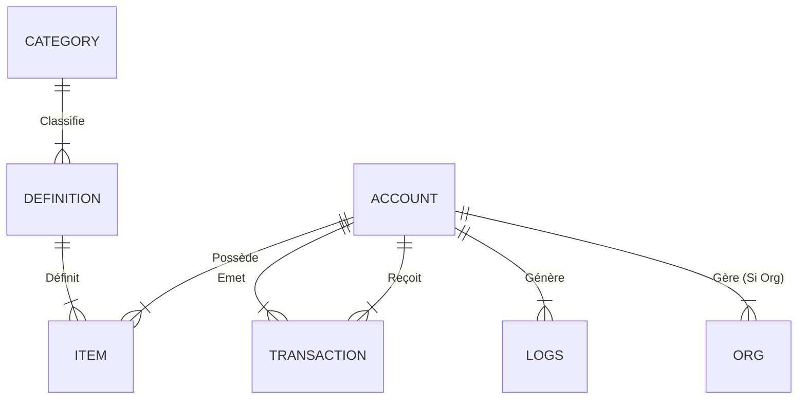

# Aether DB - Schéma de Données (SQL)

Ce document décrit l'architecture de la base de données relationnelle utilisée par Aether.
Il est destiné aux développeurs souhaitant effectuer des requêtes manuelles ou comprendre le stockage.

---

## 1. Modèle Conceptuel de Données (MCD)

Le MCD représente la structure "métier" des données.

**Entités Principales :**

- **ACCOUNT** : Entité centrale (Joueur ou Organisation) possédant argent et matériaux.
- **DEFINITION** : Catalogue statique des objets (Blueprints).
- **ITEM** : Instance physique d'un objet possédée par un Compte.
- **CATEGORY** : Classification des définitions.
- **TRANSACTION** : Historique immuable des échanges.

---

## 2. Modèle Logique de Données (MLD / Tables)

Voici la structure exacte des tables SQL (MySQL/SQLite).

### 🏦 Économie & Comptes

#### `aether_accounts`

Table principale stockant les portefeuilles.
| Colonne | Type | Description |
|:--------|:-----|:------------|
| **`id`** | `VARCHAR(64)` | **PK**. SteamID64 ou ID Organisation. |
| `balance` | `BIGINT` | Solde monétaire. |
| `type` | `VARCHAR(32)` | 'player' ou 'org'. (Indexé V7) |
| `owner_id` | `VARCHAR(64)` | Propriétaire (si Org). |
| `materials` | `LONGTEXT` | Stockage JSON `{"wood": 50}`. |
| `last_updated` | `INTEGER` | Timestamp UNIX. |

#### `aether_orgs`

Méta-données spécifiques aux organisations (extension de `aether_accounts`).
| Colonne | Type | Description |
|:--------|:-----|:------------|
| **`id`** | `VARCHAR(64)` | **PK**. FK vers `aether_accounts.id`. |
| `name` | `VARCHAR(128)` | Nom affiché. |
| `roles_data` | `TEXT` | JSON des Grades et Permissions. |
| `members_data` | `TEXT` | JSON de la liste des membres. |
| `params` | `TEXT` | JSON paramètres divers (couleur, logo). |

#### `aether_transactions`

Historique immuable des échanges.
| Colonne | Type | Description |
|:--------|:-----|:------------|
| **`id`** | `VARCHAR(64)` | **PK**. UUID. |
| `sender_id` | `VARCHAR(64)` | Émetteur (Indexé V7). |
| `receiver_id` | `VARCHAR(64)` | Destinataire (Indexé V7). |
| `amount` | `BIGINT` | Montant transféré. |
| `reason` | `VARCHAR(255)` | Contexte de la transaction. |
| `timestamp` | `INTEGER` | Date de l'opération. |

---

### 📦 Inventaires

#### `aether_definitions`

Le catalogue de référence (Items Config).
| Colonne | Type | Description |
|:--------|:-----|:------------|
| **`class_id`** | `VARCHAR(64)` | **PK**. Identifiant technique (ex: `weapon_ak47`). |
| `name` | `VARCHAR(64)` | Nom affiché. |
| `category_id` | `VARCHAR(32)` | FK vers `aether_categories`. |
| `model` | `VARCHAR(128)` | Chemin `.mdl`. |
| `type` | `VARCHAR(50)` | `item`, `weapon`, `entity`. |
| `price` | `BIGINT` | Prix d'achat shop. |
| `weight` | `DOUBLE` | Poids unitaire. |
| `width`/`height` | `INT` | Taille grille (ex: 2x1). |
| `data` | `TEXT` | JSON données custom. |

#### `aether_items`

Les instances d'objets (Inventaires Joueurs/Orgs).
| Colonne | Type | Description |
|:--------|:-----|:------------|
| **`id`** | `VARCHAR(64)` | **PK**. UUID unique (ex: `item_17200...`). |
| `owner_id` | `VARCHAR(64)` | FK vers `aether_accounts`. (Indexé V7). |
| `class_id` | `VARCHAR(64)` | FK vers `aether_definitions`. |
| `data` | `TEXT` | JSON état instance (durabilité, munitions). |

#### `aether_categories`

| Colonne       | Type          | Description           |
| :------------ | :------------ | :-------------------- |
| **`id`**      | `VARCHAR(32)` | **PK**. (ex: `food`). |
| `name`        | `VARCHAR(64)` | Nom affiché.          |
| `parent_id`   | `VARCHAR(32)` | Sous-catégorie.       |
| `icon`        | `VARCHAR(64)` | Chemin icône.         |
| `order_index` | `INTEGER`     | Ordre de tri.         |

---

### 📜 Sécurité & Audit

#### `aether_logs`

Logs génériques système.
| Colonne | Description |
|:--------|:------------|
| **`id`** | UUID |
| `actor_id` | Joueur (Indexé V7). |
| `message` | Contenu. |
| `type` | Catégorie de log. |

#### `aether_logs_inventory`

Trace tous les mouvements d'items.

- **Action** : `DROP`, `PICKUP`, `USE`, `GIVE`.
- **Source** : Provenance (ex: coffre, autre joueur).

#### `aether_logs_admin`

Trace l'utilisation des commandes Admin Aether.

---

## 3. Optimisations (V7)

Les index suivants ont été ajoutés pour garantir la performance "Lag-Free" :

- `idx_items_owner` : Chargement inventaire instantané.
- `idx_accounts_type` : Filtrage rapide des organisations.
- `idx_trans_sender` / `idx_trans_receiver` : Historique rapide.
- `idx_logs_actor` : Recherche de logs par joueur.
